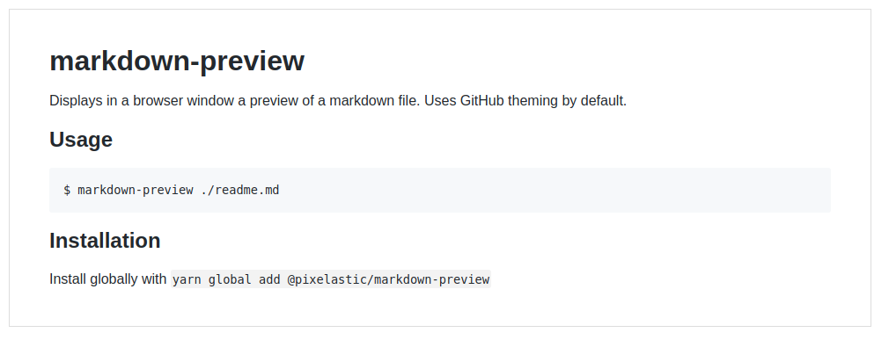

# markdown-preview

Displays in a browser window a preview of a markdown file. Uses GitHub theming
by default.

## Usage

```sh
$ markdown-preview ./readme.md
```



## Installation

Install globally with `yarn global add @pixelastic/markdown-preview`

